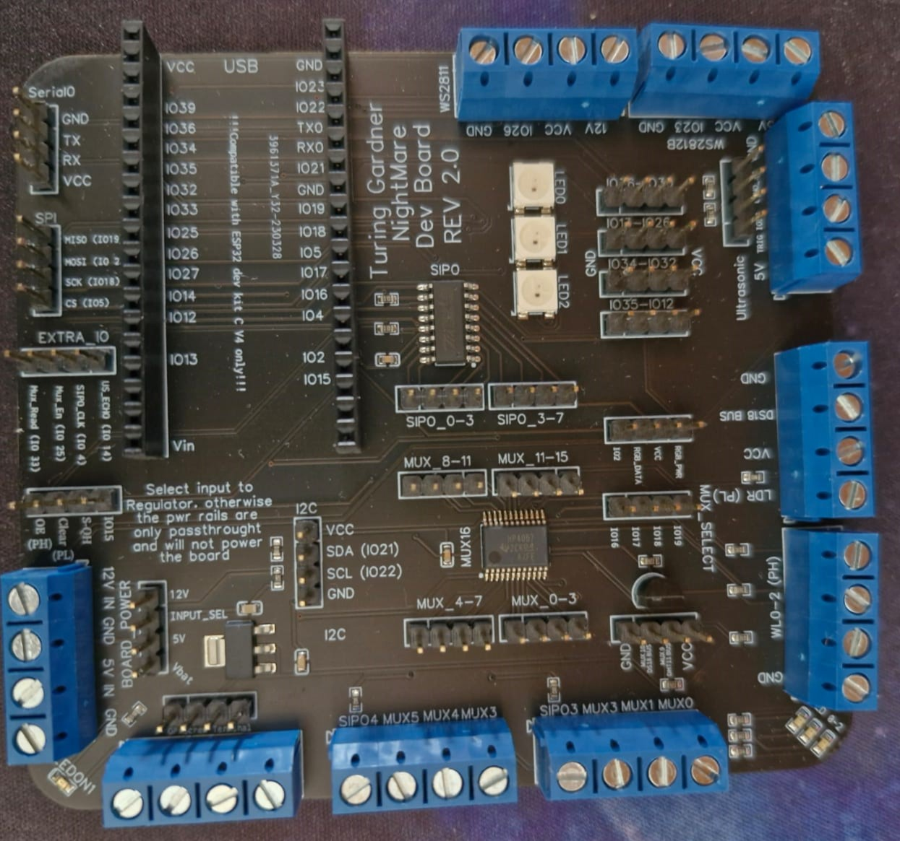
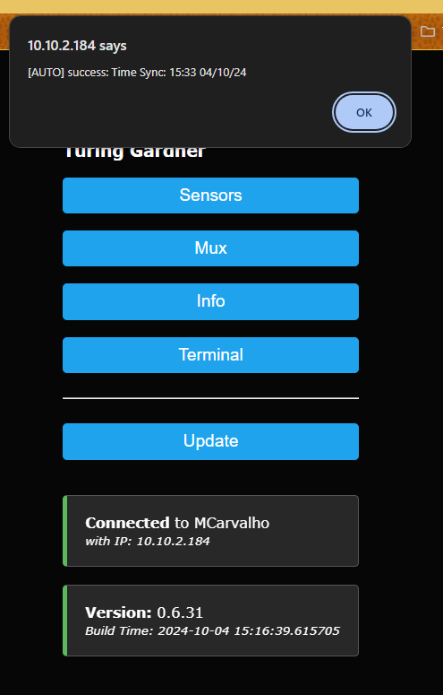
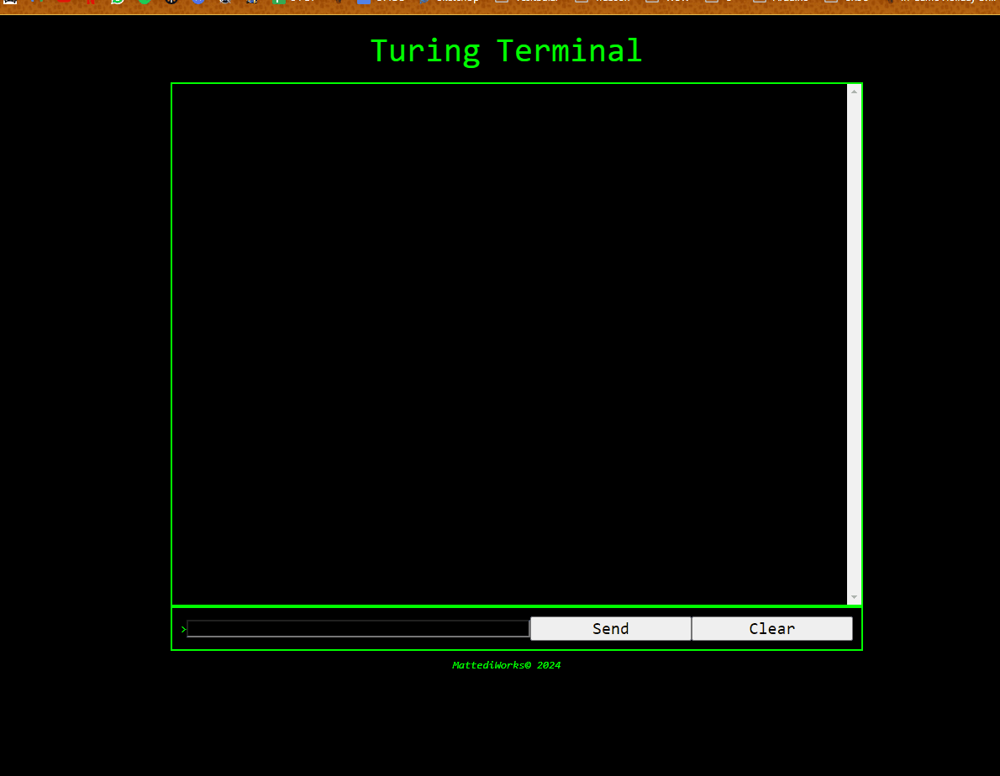
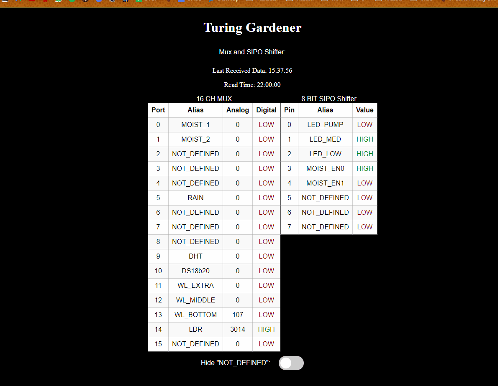
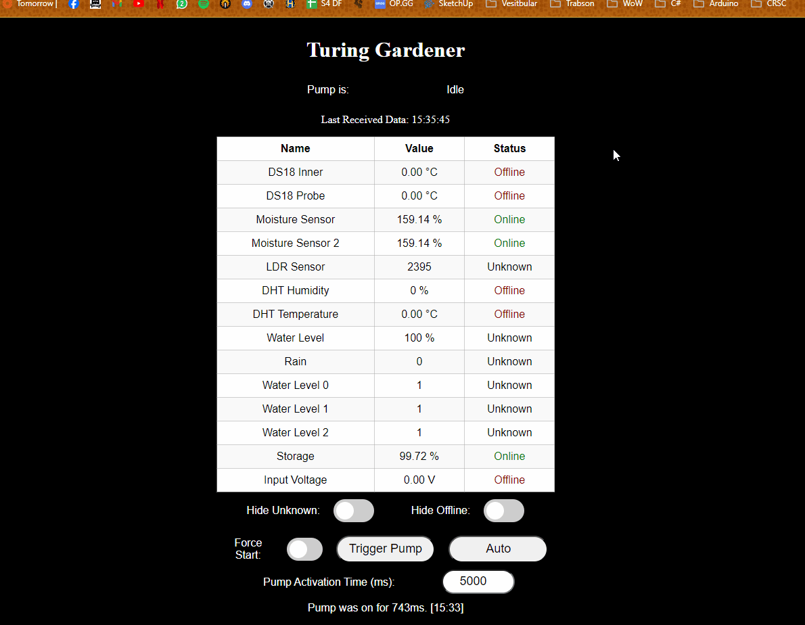
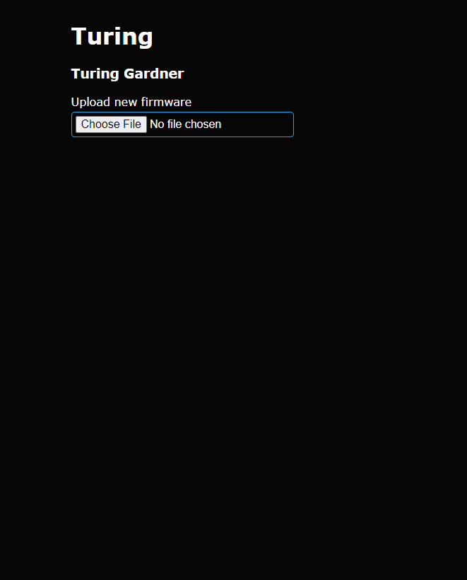

# TuringV2

Turing Gardner with the second version of the development board for garden automation.

## What does it do?

It is a garden watering automatic system. It reguaraly water the plants of a garden (interval can be set by user). It also polls data from all sensors atached. 
I have developed a board to have most of the peripherals that I need and order it from JLCPCB.
It has a slot for an esp32, an onboard 4-bit Mux and a Serial-In-Parallel-Out shift register. The board also has 3 onboard ARGB LEDs and a lot of physical connections to user usage. and it is very modular, each screw terminal is also connected to a specific pin header, and with some jumpers you can you the onboard voltage regulator with either 12V or 5V, connect I2C peripherals etc.

  


## How do I interact with it?
By default, it has two communications: a TCP server, Listening on port 100, and a web server [Web Server](#WebServer)
(Besides the common serial port)

## Web Server

There are two major components here:
 * The Web Server itself.
 * Designing the server.

 Although I have to serve static files (this project does not aim to be a full web app and just an interface to the microcontroller) I created [Python](/src/WebPage/genHeaders.py) script to convert the files in the Web project's folder it is also available [here](https://github.com/vtmattedi/WebpageHeaderGenerator) into c++ header files.


 ### Flash vs compile files
  I could load the pages into the flash memory and serve them using LittleFS but that process is harder to automate  
  on ´´plataformio.ini´´ I can run pre-build scripts automatically before build, which means that I can edit the pages on WebFolder and they will be static files. The script also makes it possible to replace something like the device name statically. 

 The web server itself has a couple of pages and some APIs to get and set the state of the microcontroller.

 However, it is **NOT** a fully secure server. It does not have **https** and **ssl** support do not expose outside of the local network.

## Web Pages:
 * **Landing page:** Inspired by the [WifiManager Library](https://github.com/tzapu/WiFiManager) it shows some status and links to the useful wepages.
 


* **Terminal:** A small "terminal" that can interact directly with the HandleCommand Api



* **Mux/Sipo:** Live monitors the Sipo/Mux devices



 * **Sensors:** Live monitors the sensors available




 * **Upload:** Uploader for new firmware binaries.



### Apis

* ```/pumpstart```
Starts the pump.
* ```/pumpauto```
Runs the pump automation function manually
* ```/config```
Gets and Sets configs
* ```/sipow```
Writes to the SIPO shifter
* ```/muxdata```
Gets the mux data
* ```/changewl```
Changes the water level sensors to a specific order and sets if they are inverted or not
* ```/sensordata```
Gets data from the sensors
* ```/version```
Gets the version and the build time

## January 19, 2038, The doomsday date!

This implemetation relies heavily on the timeLib library and use its ´´´now();´´´ to time execution of non time-senstive tasks such as turn on and off the pump and send new data for the available services. It uses a unsigned int to store the timestamp in seconds and when it overflows, the overall work flow of the code should not change much, there will be a turning on of the pump and a sending of the data to the front end servers at 03:14:07 19/01/2038 but only once, after that everything should be *normal*. The things that may break are syncing time online and obviously the readable prints of the dates will be inacurrate.
The timestamps will also be afected but if a log is needed one could always just add INT_MAX to the timestamp and calculate the time from there. However by that time is heavily advised that the current tecnology should be implemented.
